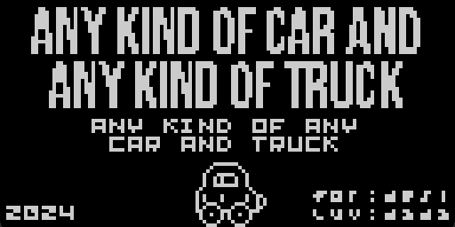
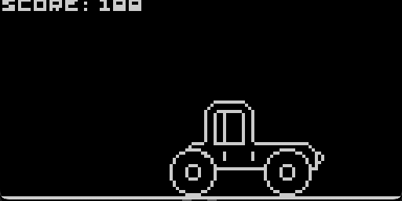
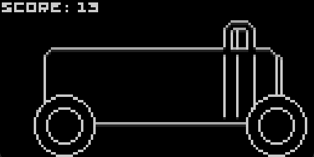
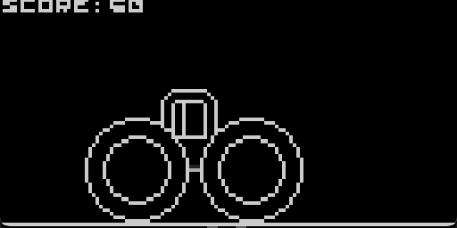

# Any Kind of Car and Any Kind of Truck

[Play Online](https://tiberiusbrown.github.io/Ardens/player.html?file=https://github.com/rocktronica/any-kind-of-car-and-any-kind-of-truck/raw/main/any-kind-of-car-and-any-kind-of-truck.ino.hex)

An Ardubody ~game for my vehicle-obsessed toddler! Make randomly dimensioned vehicles and move them around.

| Buttons | Action |
| -- | -- |
| A | toggle title |
| B | randomize vehicle |
| Up | jump |
| Down | crouch |
| Left | move left |
| Right | move right |
| A + B + up | big car |
| A + B + down | baby car |

NOTE: This is my first Arduboy game and I don't write a lot of C++...

## Screenshots

## License

MIT